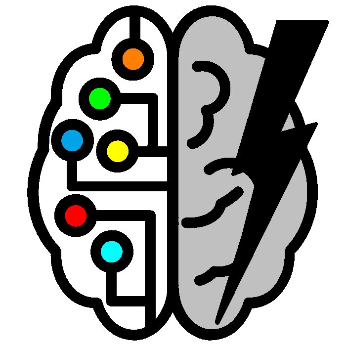

<table>
  <tr>
    <td>
      
    </td>
    <td>
      <h1 style="padding-bottom: 40px;">Brainstorm</h1>
    </td>
  </tr>
</table>

### Установка и запуск

Для того, чтобы проделать следующие шаги на Windows, установите [Git Bash](https://gitforwindows.org/)

1. Склонируйте репозиторий

```shell
git clone https://github.com/F0RRZZ/BrainStorm.git
```
2. Создайте и активируйте venv

```shell
cd BrainStorm
```
```shell
python -m venv venv
```
```shell
source venv/Scripts/activate
``` 

3. Установите зависимости

* Основные зависимости

```shell
pip install -r requirements/prod.txt
``` 

*Зависимости для разработки

```shell
pip install -r requirements/dev.txt
```

*Зависимости для тестирования

```shell
pip install -r requirements/test.txt
```

4. Устанавите переменные окружения

```shell
cd brainstorm
```
```shell
cp .env-example .env
```

Описание:
1. ALLOWED_HOSTS - список разрешенных хостов
2. DEBUG - режим отладки
3. EMAIL_ADDRESS - адрес электронной почты, с которой будут приходить письма пользователям
4. EMAIL_PASSWORD - пароль от приложения
5. GITHUB_CLIENT_ID - client id приложения в гитхабе
6. GITHUB_SECRET_KEY - секретный ключ приложения в гитхабе
7. REDIS_HOST - путь до компьютера
8. REDIS_PORT - порт для взаимодействия с Redis
9. SECRET_KEY - секретный ключ
10. USERS_AUTOACTIVATE - режим автоактивации пользователей (отключение подтверждения аккаунта)


Для получения client_id и secret key вам нужно зарегистрировать свое приложение на сайте GitHub.
1. Войдите в свой аккаунт на сайте GitHub.
2. Перейдите на страницу настроек приложений: https://github.com/settings/applications/new
3. Введите название вашего приложения в поле "Application name".
4. Введите домен вашего сайта в поле "Homepage URL".
5. Введите URL-адрес, на который GitHub будет перенаправлять пользователей после успешной аутентификации, в поле "Authorization callback URL".
6. Нажмите на кнопку "Register application".
7. Вам будет предоставлен client_id и secret key.

Настройка аккаунта Google для отправки сообщений:
1. Создайте новый аккаунт
2. Впишите адрес электронной почты в переменную EMAIL_ADDRESS в .env
3. Перейдите во вкладку "Безопасность" в управлении аккаунтом
4. Включите двухэтапную аутентификацию
5. Перейдите в раздел "Пароли приложений"
6. В поле "Приложение" выберите YouTube, а в "Устройство" - компьютер Windows
7. Нажмите на кнопку "Создать"
8. Полученный ключ впишите в переменную EMAIL_PASSWORD в .env

---

5. Создайте базу данных
Создание с помощью миграций

```shell
python manage.py makemigrations
```
```shell
python manage.py migrate
```

Далее нужно создать аккаунт суперпользователя

```shell
python manage.py createsuperuser
```

Также можно взять тестовые данные из фикстуры:

| Windows                                | Linux/MacOS                             |
|----------------------------------------|-----------------------------------------|
| ```python manage.py loaddata core/fixtures/data.json``` | ```python3 manage.py loaddata core/fixtures/data.json``` |

В случае, если вы не используете тестовые данные, необходимо удалить из папки media всё, кроме папки images

6. Сгенерируйте файлы для перевода

```shell
python manage.py compilemessages
``` 

7. Запустите сервер

```shell
python manage.py runserver
```

Далее перейдите по ссылке 
```
http://127.0.0.1:8000
```

### Для реализации скрытия неоригинальных идей:
1. Установить в качестве брокера сервер redis

| Windows                      | Linux/MacOS                                |
|------------------------------|--------------------------------------------|
| ```https://clck.ru/34A34T``` | ```sudo docker run -d -p 6379:6379 redis```|


2. Запустите рабочие процессы - worker(в отдельном терминале)

```shell
celery -A brainstorm worker -l info
```

3. Запустите планировщик задач - beat(в отдельном терминале)

```shell
celery -A brainstorm beat -l info
```
